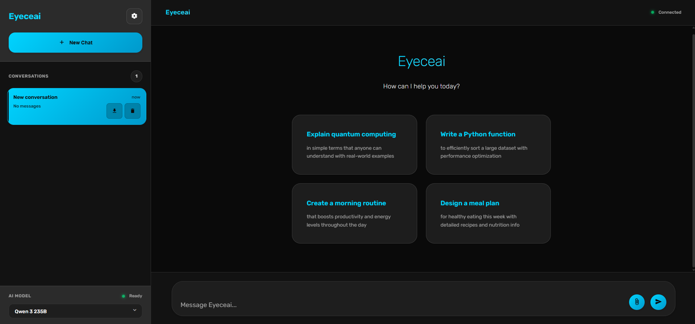
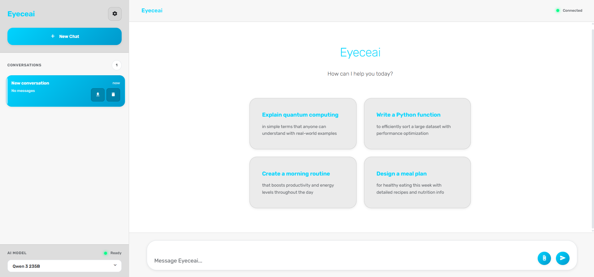

# 🔥 EyeceAI

> Modern AI Chat Platform - Powered by OpenRouter API

  <h2>🔥 EyeceAI</h2>
  
  **A beautiful, modern AI chat platform supporting multiple models with intelligent memory system**
  
  [🚀 Try Demo](https://abdvlrqhman.com/eyeceai) • [📖 Docs](https://github.com/abdvlrqhman/EyeceAI/blob/main/docs.md) • [🐛 Report Bug](https://github.com/abdvlrqhman/EyeceAI/issues) • [✨ Request Feature](https://github.com/abdvlrqhman/EyeceAI/issues)

---

## ✨ Features

- 🧠 **Smart Memory System** - Learns your preferences for personalized conversations
- 🎯 **Multiple AI Models** - Gemini 2.0 Flash, DeepSeek R1, Qwen 3, and more
- 📱 **Fully Responsive** - Perfect experience across all devices
- 🔒 **Privacy First** - Your data stays secure with local storage
- ⚡ **Real-time Streaming** - Watch responses generate in real-time
- 📂 **File Support** - Upload images, documents, and code files
- 🎨 **Beautiful UI** - Dark/light themes with glassmorphism design
- 🌐 **RTL Support** - Built-in Arabic language support
- 💾 **Auto-save** - Never lose your conversations
- 🔄 **Export/Import** - Backup and restore your data

## 🚀 Quick Start

### 1. Visit the Demo
Go to [https://abdvlrqhman.com/eyeceai](https://abdvlrqhman.com/eyeceai)

### 2. Get Your OpenRouter API Key
1. Visit [openrouter.ai](https://openrouter.ai)
2. Sign up with your email
3. Navigate to the "Keys" section
4. Create a new API key
5. Copy the key (keep it safe!)

### 3. Start Chatting
1. Enter any username
2. Paste your OpenRouter API key
3. Select your preferred AI model
4. Start chatting instantly!

No downloads, no complex setup - just pure web-based AI chat experience!

## 🛠️ Technical Stack

- **Frontend**: Pure HTML/CSS/JavaScript (No frameworks!)
- **API**: OpenRouter Integration  
- **Storage**: Browser LocalStorage
- **Styling**: CSS Grid/Flexbox + Glassmorphism Effects
- **Architecture**: Modular ES6 Classes
- **Hosting**: Custom web server
- **Deployment**: Live at abdvlrqhman.com/eyeceai

## 📋 Supported Models

- **Gemini 2.0 Flash** - Google's latest multimodal model
- **DeepSeek R1** - Advanced reasoning capabilities
- **Qwen 3 235B** - Large-scale language understanding
- **Llama 3.1 Nemotron Ultra** - High-performance responses
- **Gemma 3 12B IT** - Efficient instruction following
- **Qwen Coder** - Specialized for programming tasks
- **Custom Models** - Add your own OpenRouter-compatible models

## 📱 Screenshots

  
  

*Experience EyeceAI in both dark and light themes with beautiful glassmorphism design*

## 🎯 Key Features Deep Dive

### Memory System
EyeceAI automatically learns from your conversations:
- **Name Recognition** - Remembers your name and uses it naturally
- **Preference Learning** - Tracks what you like and dislike
- **Custom Instructions** - Set specific behavior guidelines
- **Context Awareness** - Uses memory to provide relevant responses

### File Support
Upload and discuss various file types:
- **Images** - PNG, JPG, GIF, WebP
- **Documents** - PDF, TXT, MD
- **Code Files** - JS, Python, HTML, CSS, JSON
- **Data Files** - CSV for analysis

### Responsive Design
- **Mobile-First** - Optimized touch interface
- **Tablet Support** - Perfect for medium screens
- **Desktop Power** - Full feature set on large screens
- **PWA Ready** - Install as a native app

## 🌐 Access & Availability

EyeceAI is currently available as a **live web application** at:

**🚀 [https://abdvlrqhman.com/eyeceai](https://abdvlrqhman.com/eyeceai)**

- ✅ **No installation required** - runs directly in your browser
- ✅ **Always up-to-date** - latest features automatically available
- ✅ **Cross-platform** - works on any device with a modern browser
- ✅ **Instant access** - just visit the link and start chatting

> **Note**: This repository serves as documentation and project information. The source code is proprietary and hosted separately.

## 📚 Documentation

- [Getting Started Guide](docs.md#getting-started)
- [Features Overview](docs.md#features)
- [Usage Guide](docs.md#usage-guide)
- [Customization](docs.md#customization)
- [FAQ](docs.md#faq)
- [Advanced Usage](docs.md#advanced-usage)

## 🤝 Contributing

While the source code is not currently open source, I welcome feedback and suggestions!

**Ways to contribute:**
- 🐛 **Report bugs** via [GitHub Issues](https://github.com/abdvlrqhman/EyeceAI/issues)
- 💡 **Suggest features** through [GitHub Issues](https://github.com/abdvlrqhman/EyeceAI/issues)
- 📧 **Direct feedback** via [ice@spacie.net](mailto:ice@spacie.net)
- 💬 **Connect** on [LinkedIn](https://www.linkedin.com/in/abdvlrqhman/)

Your input helps make EyeceAI better for everyone!

## 📝 Changelog

### v1.0.0 (Current)
- Initial release
- Multi-model AI chat support
- Smart memory system
- File upload capabilities
- Responsive design
- Dark/light themes
- RTL language support

## 🐛 Known Issues

- Large files (>10MB) may cause performance issues
- Some older browsers may not support all features
- Mobile keyboard may cover input on some devices

## 🚀 Roadmap

- [ ] Voice input/output support
- [ ] Plugin system for extensions
- [ ] Team collaboration features
- [ ] Advanced file analysis
- [ ] Multi-language interface
- [ ] Desktop app (Electron)

## 📄 License

This project is licensed under the MIT License - see the [LICENSE](LICENSE) file for details.

## 👨‍💻 Author

**Abdulrahman (ICEdev)**
- Website: [abdvlrqhman.com](https://abdvlrqhman.com/contact)
- LinkedIn: [abdvlrqhman](https://www.linkedin.com/in/abdvlrqhman/)
- GitHub: [@abdvlrqhman](https://github.com/abdvlrqhman)
- Email: [ice@spacie.net](mailto:ice@spacie.net)
- Portfolio: [abdvlrqhman.com](https://abdvlrqhman.com)

## 🙏 Acknowledgments

- [OpenRouter](https://openrouter.ai) for API access
- [Highlight.js](https://highlightjs.org/) for code syntax highlighting
- [Marked](https://marked.js.org/) for Markdown parsing
- Google Fonts for typography
- Material Icons for UI elements

## ⭐ Show Your Support

Give a ⭐️ if this project helped you!

  
**[🚀 Try EyeceAI Now](https://abdvlrqhman.com/eyeceai)**

Made with ❤️ by [ICEdev](https://github.com/abdvlrqhman)

